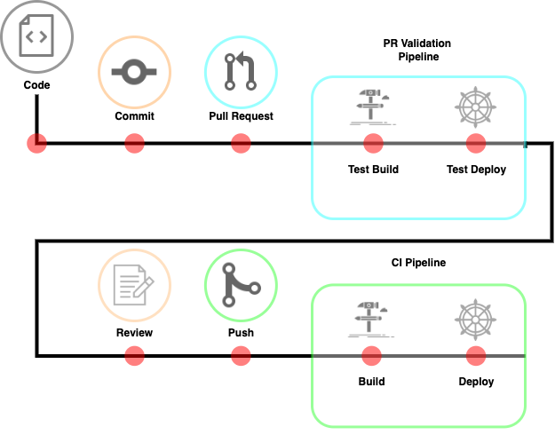

# SonarQube CI

The deployment of this application and the dependent infrastructure is managed through these CICD pipelines. All workflow logic and configuration is defined in the variable definitions.

## Pipeline Structure

- `/templates`: Parameterized pipeline templates to perform reusable tasks
- `/variables`: Global and environment specific variables to be consumed by pipeline
- `pull-request.yml`: PR validation workflow to be triggered by a PR in GitHub
- `push-merge.yml`: CI workflow to be triggered by a push in GitHub

## Requirements

- Azure DevOps Access
- GitHub repo access
- AKS namespace service account credentials
- Azure Resource Manager service principal credentials

### Service Connections

|name|type|environment|usage|description|
|-|-|-|-|-|
|ghe-oauth-eap-sre|GHE OAuth Connection|-|project|Used to connect Azure DevOps to the repository|
|am01aksdevsonarqube-helmsman|Kubernetes - Service Account|`dev`|pipeline|AKS cluster dev service account for the namespace.|
|Corp-Sonarqube-Tst-AKS-Devtest-sonarqube|Kubernetes - Service Account|`uat`|pipeline|AKS cluster uat service account for the namespace.|
|am01aksprodsonarqube-helmsman|Kubernetes - Service Account|`prod`|pipeline|AKS cluster dev service account for the namespace.|
|Corp-SonarQubeEnterprise-AppResources-DevTest|Azure Resource Manager - Service Principal|`dev`,`uat`|pipeline|Service principal connection to create resources in Azure Cloud.|
|Corp-SonarQubeEnterprise-AppResources-Prod|Azure Resource Manager - Service Principal|`prod`|pipeline|Service principal connection to create resources in Azure Cloud.|

### Pipeline Variables

|Name|Source|Description|
|-|-|-|
|PROJECT_NAME|`global.yml`| Name of the project, used in creating remote state files.|
|TF_VERSION|`global.yml`|Semantic version of Terraform to use in pipeline.|
|HELMSMAN_VERSION|`global.yml`|Semantic version of Helmsman docker image to use.|
|TERRAFORM_DIRECTORY|`global.yml`|File location where Terraform module should be referenced from project root.|
|REMOTE_BACKEND_CONNECTION|`global.yml`|Name of the ARM service connection defined in the project for connecting to the Terraform backend.|
|REMOTE_RESOURCE_GROUP|`global.yml`|Name of the resource group for the Terraform backend.|
|REMOTE_STORAGE_ACCOUNT_NAME|`global.yml`|Name of the storage account in which to save the state file.|
|REMOTE_CONTAINER_NAME|`global.yml`|Name of the storage container in which to save the state file.|
|KUBERNETES_SERVICE_ACCOUNT|`global.yml`|Name of the service account authenticating to the cluster-namespace.|
|AZ_SERVICE_CONNECTION|`<env>.yml`|Name of the ARM service connection defined in the project for provisioning dependant Azure Cloud resources.|
|KUBERNETES_SERVICE_CONNECTION|`<env>.yml`|Name of the kubernetes service connection defined in the project for the cluster-namespace service account.|
|KUBERNETES_NAMESPACE|`<env>.yml`|The cluster namespace these services will be created in.|
|TF_VAR_FILE|`<env>.yml`|File path location for the Terraform variable file for the environment. Relative from path `/infrastructure`.|
|HELMSMAN_TOML_FILE|`<env>.yml`|File path location for the Helmsman config file for the environment.|

## Workflow

This repository contains two pipelines, triggered individually by a Pull Request event and a Push event. The branches will define which variable configurations to use, with the `main` branch deploying to pre-prod environment and `env-prod` branch deploying to production environment.

